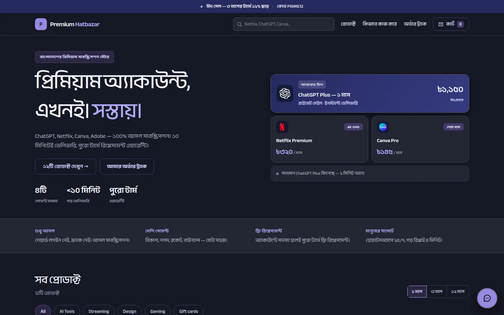
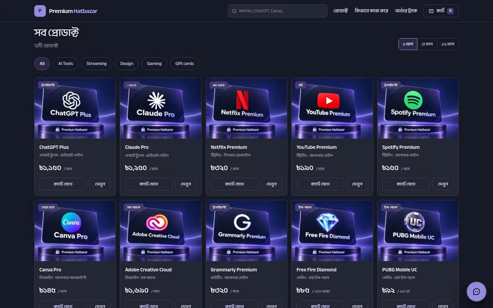
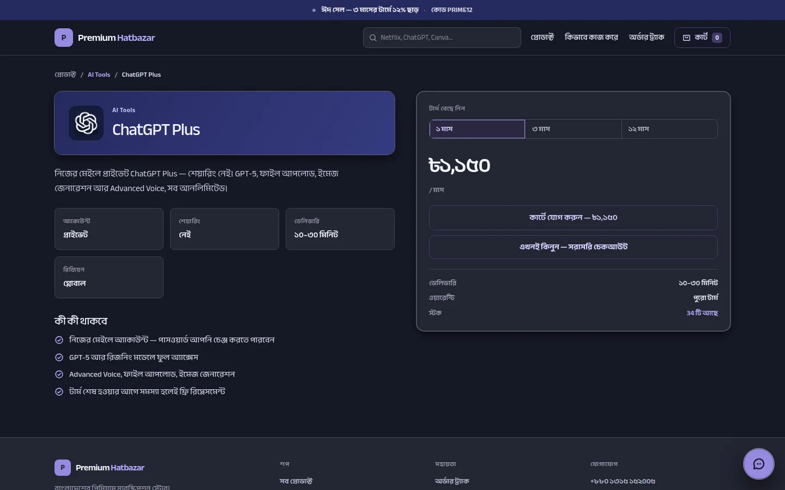
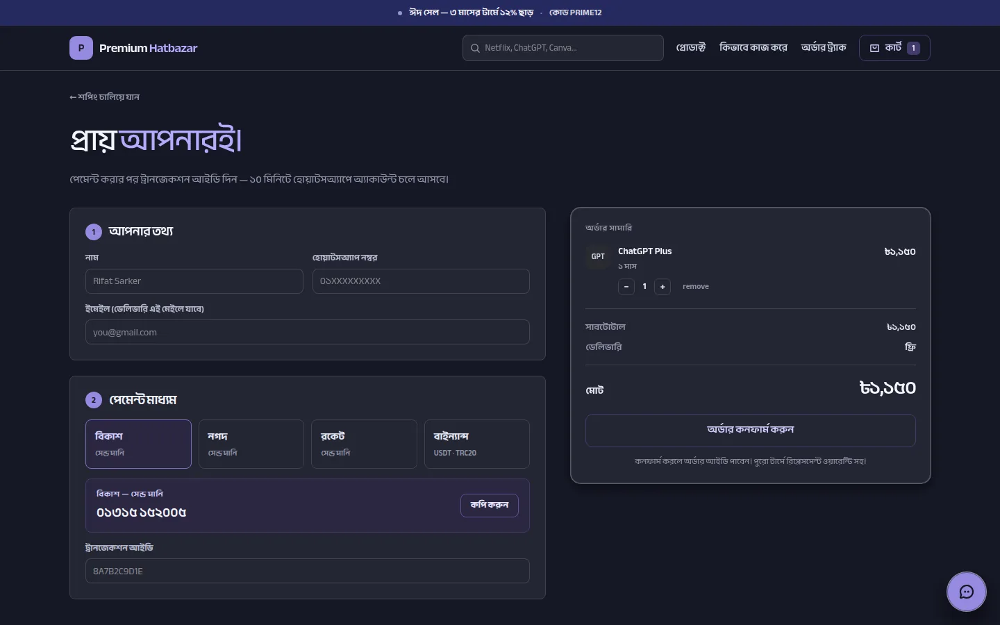
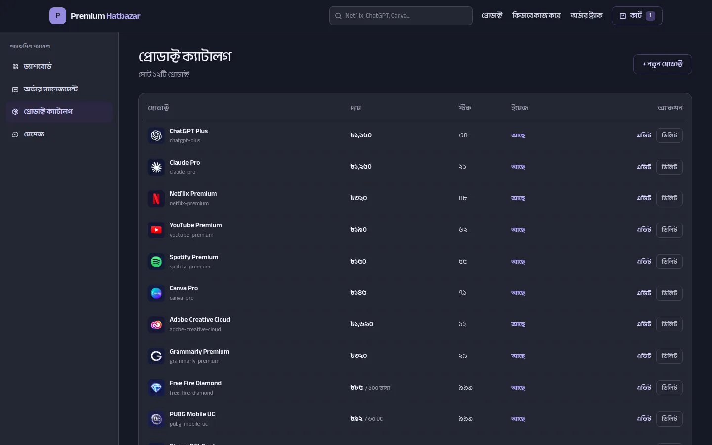
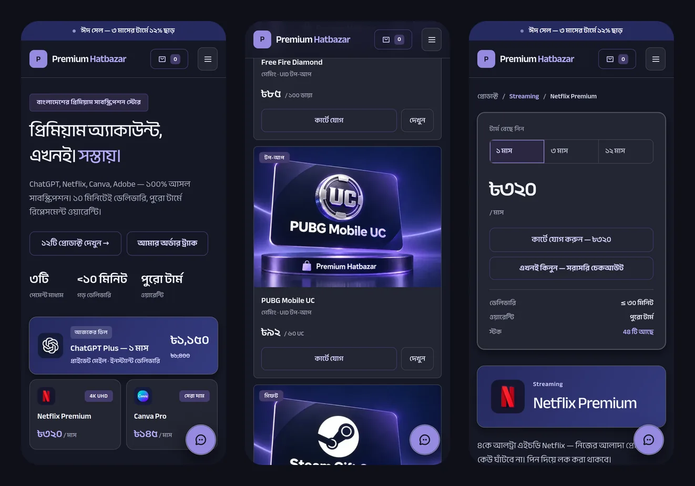
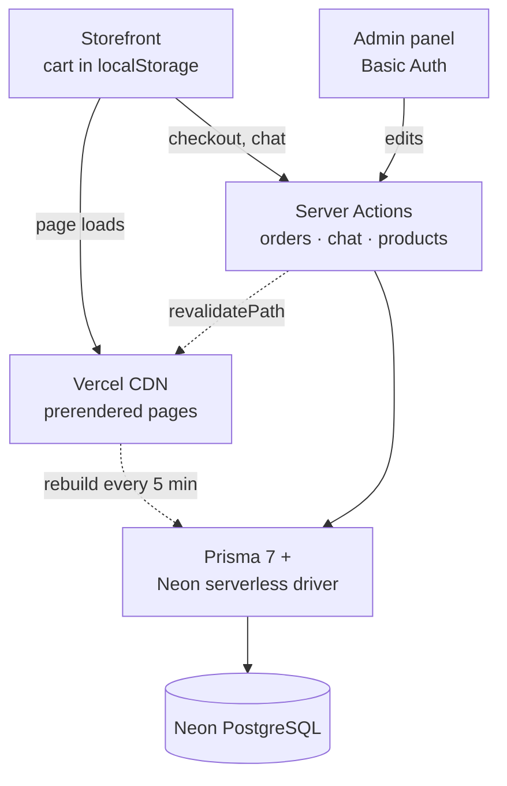
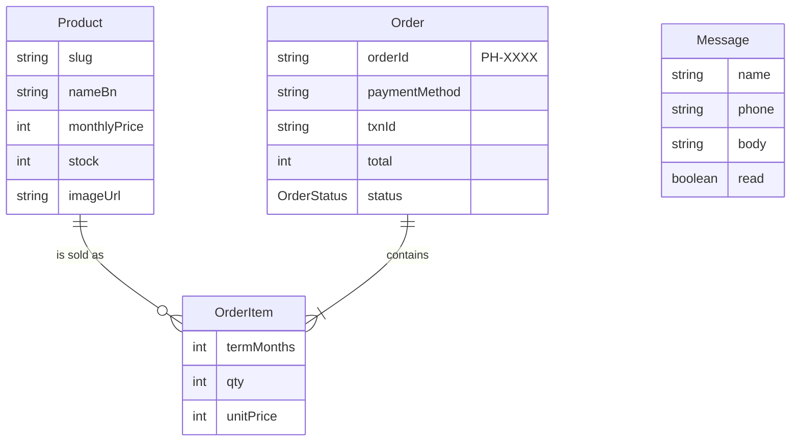

<div align="center">

# Premium Hatbazar

**A Bengali-first e-commerce store for premium digital subscriptions — storefront, checkout,
order tracking and an admin panel in one Next.js codebase.**

[**Live demo →**](https://premiumhatbazar.vercel.app)




</div>

## Overview

Customers in Bangladesh browse AI tools, streaming, design, gaming and gift-card products, pick a
1, 3 or 12-month term, pay with bKash, Nagad, Rocket or Binance, and follow their order on a
tracking page. The store owner verifies payments, moves orders through their statuses and manages
the catalogue from a password-protected admin panel. The interface is in Bengali, with Bengali
numerals for prices.

### Highlights

- **Full-stack in one codebase** — storefront, checkout, order tracking, customer chat and admin
  panel on the Next.js App Router with Server Actions and Prisma.
- **Fast on real phones** — pages are prerendered and served from the CDN; Lighthouse scores
  **100** for Performance on desktop and about **90** on mobile.
- **Accessible** — Lighthouse Accessibility, Best Practices and SEO all at **100**.
- **Serverless PostgreSQL** — Prisma 7 with the Neon serverless driver (queries over HTTPS,
  transactions over WebSockets), so it runs on Vercel without connection-pool trouble.

## Screenshots

| Catalogue | Product page |
| :---: | :---: |
|  |  |
| **Checkout** | **Admin — product catalogue** |
|  |  |

<p align="center">
  
</p>

## Features

### Storefront

- **Catalogue** with category filters (AI Tools, Streaming, Design, Gaming, Gift cards) and live
  search from the header.
- **Term-based pricing** — 1, 3 or 12 months with 10% and 22% discounts, rounded to the nearest
  5 taka (`lib/price.ts`); one-time top-ups such as game currency skip the term.
- **Cart** kept in the browser, with quantities and a slide-in cart panel.
- **Checkout** with bKash, Nagad and Rocket (Send Money) or Binance (USDT · TRC20); the customer
  enters the transaction ID and gets a short order ID such as `PH-4821` (unique, retried on the
  rare collision).
- **Order tracking** at `/track/<order id>` with a four-step timeline: order received → payment
  verified → account ready → delivered.
- **Chat widget** — customer messages land in the admin inbox.
- **Motion** — Lenis smooth scrolling and GSAP scroll reveals, both switched off for visitors who
  prefer reduced motion.

### Admin panel (`/admin`)

- **Dashboard** — total sales, pending, total and delivered orders, plus the latest orders.
- **Order management** — move an order from Pending to Verified, Delivered or Cancelled; the
  customer's tracking page follows along.
- **Product catalogue** — create, edit and delete products: price, stock, badge, specs and image.
- **Messages** — the chat inbox.
- Protected with HTTP Basic Auth (`proxy.ts`) as soon as `ADMIN_PASSWORD` is set.

## Performance and quality

Lighthouse 12.8 on the production build (mobile uses Lighthouse's default slow-4G and
mid-range-phone throttling):

| Page | Performance (mobile) | Performance (desktop) | Accessibility | Best Practices | SEO |
| --- | :---: | :---: | :---: | :---: | :---: |
| Home | 90 | 100 | 100 | 100 | 100 |
| Product | 92 | 100 | 100 | 100 | 100 |
| Checkout | 93 | 100 | 100 | 100 | 100 |
| Order tracking | 93 | 100 | 100 | 100 | 100 |

Mobile scores move a few points between runs. What gets them there:

- **Prerendered pages.** Home and product pages are built ahead of time and served from the CDN,
  refreshed in the background every 5 minutes and immediately after an admin edit
  (`revalidatePath`). Keeping the cart in `localStorage` means no page needs request-time cookies.
- **One font.** A single self-hosted Bengali/Latin family (Anek Bangla via `next/font`); two
  unused families were removed, cutting about 210 KB from the first load.
- **An image pipeline.** Each product image ships as content-hashed WebP at 640, 960 and 1280 px
  (about 30–40 KB instead of the 1.4 MB source PNG), picked per device with `srcSet`, plus a
  192 px logo crop for small thumbnails. Hashed names let `/products/*` be cached for a year.
- **No render-blocking CSS.** The ~4 KB stylesheet is inlined into the HTML.

## How it fits together





## Tech stack

| Area | Tools |
| --- | --- |
| Framework | Next.js 16 (App Router, Server Actions, Turbopack), React 19, TypeScript 5 |
| Styling | Tailwind CSS 4, Anek Bangla via `next/font`, Phosphor Icons |
| Motion | GSAP 3 (ScrollTrigger), Lenis |
| Data | Prisma 7, PostgreSQL on Neon (serverless driver) |
| Hosting | Vercel |

### Project structure

```
app/
  page.tsx               home page (prerendered)
  product/[slug]/        product pages (prerendered per product)
  checkout/              checkout
  track/[orderId]/       order tracking
  admin/                 admin panel and its server actions
  actions.ts             storefront server actions (place order, chat)
components/              UI: home, product, layout, admin, providers, shared
lib/                     Prisma client, queries, pricing, Bengali numerals, image helpers
prisma/                  schema and seed script
public/products/         product images (content-hashed WebP)
proxy.ts                 Basic Auth for /admin
```

## Getting started

Requires Node.js 20.9 or newer and a PostgreSQL database (Neon works out of the box).

```bash
git clone https://github.com/Raju0131/Premium-Hatbazar.git
cd Premium-Hatbazar
npm install              # also generates the Prisma client
cp .env.example .env     # then set DATABASE_URL
npx prisma db push       # create the tables
npm run seed             # load the 12 catalogue products
npm run dev              # http://localhost:3000
```

> **Careful:** `npm run seed` deletes every product and re-creates them from `lib/products.ts`.
> Don't run it against the live database once products have been edited in the admin; it also
> fails as soon as any order references a product.

### Environment variables

| Variable | Required | Purpose |
| --- | --- | --- |
| `DATABASE_URL` | Yes | PostgreSQL connection string (for Neon, the pooled one from **Connect**). |
| `ADMIN_PASSWORD` | In production | Turns on HTTP Basic Auth for `/admin`. Without it the admin is open. |
| `ADMIN_USER` | No | Admin username, `admin` by default. |
| `NEXT_PUBLIC_SITE_URL` | No | Public URL used for metadata and social previews. |

### Deploying to Vercel

1. Import the repository in Vercel (framework preset: Next.js). The build runs `prisma generate`
   itself, so no extra build settings are needed.
2. Add the environment variables above under **Settings → Environment Variables**.
3. Redeploy after adding or changing a variable; variables only apply to new deployments.

The storefront pages are prerendered during the build, reading products from the database.

## Managing content

- **Products and prices** — edit them in the admin; the storefront updates immediately.
  Changes made directly in the database appear within about 5 minutes.
- **Product images** — the 12 catalogue products use bundled images in `public/products/`, four
  files per product sharing a content hash: `<slug>.<hash>.webp` (1280 px, the one `imageUrl`
  points to), `-960` and `-640` copies for `srcSet`, and a square `-icon` crop for thumbnails.
  When replacing one, add new files with a new hash rather than overwriting, and update
  `imageUrl`. Any other https image URL can also be set in the admin, for example:

  ```sql
  UPDATE "Product" SET "imageUrl" = 'https://your-host.com/canva.png' WHERE slug = 'canva-pro';
  ```

## Author

Built by **Md. Raju Ahmed** — full-stack developer (Next.js, React, TypeScript, Node.js,
PostgreSQL) from Rajshahi, Bangladesh, who also builds real-time 3D for the web (three.js,
React Three Fiber).

[Portfolio](https://rifatsarkerraju.com) · [GitHub](https://github.com/Raju0131) ·
[Fiverr](https://www.fiverr.com/iamraju19)

## License

Copyright © 2026 Md. Raju Ahmed. All rights reserved. The code is public so it can be reviewed;
using it, in whole or in part, needs written permission. See [LICENSE](LICENSE).

---

<sub>Product names and logos shown in the store belong to their respective owners. Premium
Hatbazar is an independent store and is not affiliated with or endorsed by them.</sub>
